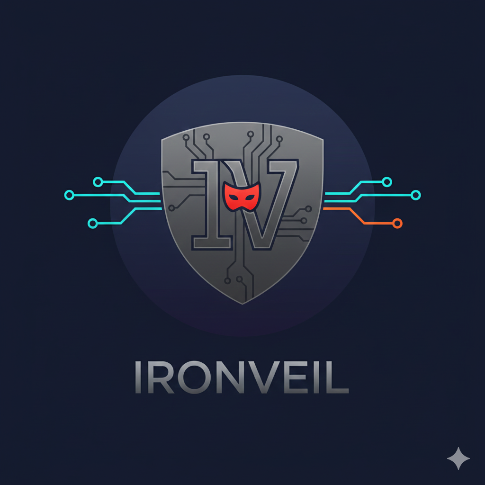

<p align="center">
  
</p>

# IronVeil

**IronVeil** is a high-performance, Rust-based database proxy designed for real-time PII (Personally Identifiable Information) anonymization. It sits between your application and your database, intercepting queries and masking sensitive data on the fly without requiring changes to your application code.

## Features

*   **Real-time Anonymization**: Masks PII data (emails, credit cards, phone numbers, addresses) in database result sets.
*   **Multi-Database Support**: Works with both **PostgreSQL** and **MySQL** wire protocols.
*   **Zero-Copy Parsing**: Built with `tokio` and `bytes` for high throughput and low latency.
*   **Configurable Rules**: Define masking strategies per table and column via `proxy.yaml`.
*   **Heuristic PII Detection**: Automatically detects and masks PII using regex patterns (emails, credit cards).
*   **JSON/Array Support**: Recursively masks PII in JSON objects and PostgreSQL/MySQL array types.
*   **Deterministic Masking**: Same input always produces the same fake output (useful for testing).
*   **TLS Support**: Client-to-proxy and proxy-to-upstream TLS encryption.
*   **OpenTelemetry**: Distributed tracing integration for observability.
*   **Live Inspector**: View real-time query logs and data transformations via the web dashboard.

## Tech Stack

*   **Core**: Rust 2024 Edition (Tokio, Axum, tokio-util)
*   **Frontend**: Next.js, Tailwind CSS, Shadcn UI
*   **Observability**: OpenTelemetry (OTLP)
*   **Deployment**: Docker Compose

## Getting Started

### Quick Start with Docker

1.  **Start the stack**:
    ```bash
    docker compose up -d --build
    ```

2.  **Access the Dashboard**:
    Open [http://localhost:3000](http://localhost:3000) to view the control plane.

3.  **Connect to the Proxy (PostgreSQL)**:
    ```bash
    psql -h 127.0.0.1 -p 6543 -U postgres
    ```

### Running Locally

```bash
# Build
cargo build --release

# Run with PostgreSQL (default)
./target/release/iron-veil --port 6543 --upstream-host 127.0.0.1 --upstream-port 5432

# Run with MySQL
./target/release/iron-veil --port 6543 --upstream-host 127.0.0.1 --upstream-port 3306 --protocol mysql
```

## CLI Options

```
Usage: iron-veil [OPTIONS]

Options:
  -p, --port <PORT>                    Port to listen on [default: 6543]
      --upstream-host <UPSTREAM_HOST>  Upstream database host [default: 127.0.0.1]
      --upstream-port <UPSTREAM_PORT>  Upstream database port [default: 5432]
      --config <CONFIG>                Path to configuration file [default: proxy.yaml]
      --api-port <API_PORT>            Management API port [default: 3001]
      --protocol <PROTOCOL>            Database protocol to proxy [default: postgres]
                                       [possible values: postgres, mysql]
      --shutdown-timeout <SECONDS>     Graceful shutdown timeout [default: 30]
  -h, --help                           Print help
  -V, --version                        Print version
```

## Configuration

Edit `proxy.yaml` to configure masking rules:

```yaml
# TLS Configuration
tls:
  enabled: false
  cert_path: "certs/server.crt"
  key_path: "certs/server.key"

upstream_tls: false

# OpenTelemetry (send traces to Jaeger, Grafana Tempo, etc.)
telemetry:
  enabled: false
  otlp_endpoint: "http://localhost:4317"
  service_name: "iron-veil"

# Masking Rules
rules:
  - table: "users"        # Table-specific rule
    column: "email"
    strategy: "email"
  - table: "users"
    column: "phone_number"
    strategy: "phone"
  - column: "address"     # Global rule (any table)
    strategy: "address"
  - column: "metadata"    # JSON column masking
    strategy: "json"
```

### Available Masking Strategies

| Strategy | Description | Example Output |
|----------|-------------|----------------|
| `email` | Generates fake email | `john.doe@example.com` |
| `phone` | Generates fake phone number | `555-123-4567` |
| `address` | Generates fake city name | `Springfield` |
| `credit_card` | Generates fake CC number | `4532-xxxx-xxxx-1234` |
| `json` | Recursively masks PII in JSON | `{"email": "fake@example.com"}` |

## Architecture

```
┌─────────────┐     ┌──────────────┐     ┌─────────────┐
│   Client    │────▶│   IronVeil   │────▶│  Database   │
│  (psql/app) │◀────│    Proxy     │◀────│ (PG/MySQL)  │
└─────────────┘     └──────────────┘     └─────────────┘
                           │
                    ┌──────┴──────┐
                    │  Dashboard  │
                    │ (Next.js)   │
                    └─────────────┘
```

## Project Structure

```
iron-veil/
├── src/
│   ├── main.rs          # Entry point, CLI, connection handling
│   ├── config.rs        # Configuration loading (proxy.yaml)
│   ├── api.rs           # Axum management API
│   ├── state.rs         # Shared application state
│   ├── scanner.rs       # PII regex scanner
│   ├── interceptor.rs   # Anonymizer implementations (PG + MySQL)
│   ├── telemetry.rs     # OpenTelemetry setup
│   └── protocol/
│       ├── mod.rs
│       ├── postgres.rs  # PostgreSQL wire protocol codec
│       └── mysql.rs     # MySQL wire protocol codec
├── web/                 # Next.js dashboard
├── proxy.yaml           # Configuration file
└── docker-compose.yml   # Full stack deployment
```

## Development

```bash
# Run tests
cargo test

# Check for issues
cargo clippy

# Format code
cargo fmt
```

## Testing OpenTelemetry

1. Start Jaeger:
   ```bash
   docker run -d --name jaeger -p 16686:16686 -p 4317:4317 jaegertracing/all-in-one:latest
   ```

2. Enable telemetry in `proxy.yaml`:
   ```yaml
   telemetry:
     enabled: true
     otlp_endpoint: "http://localhost:4317"
     service_name: "iron-veil"
   ```

3. View traces at [http://localhost:16686](http://localhost:16686)

## License

MIT
